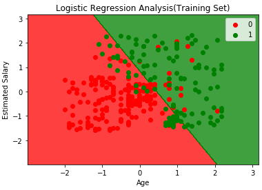
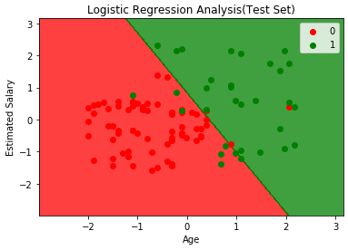

# Templates-for-Neural-Network-models
A repository which consists of a data-preprocessing-template and a classification template which can be used in neural network models.

This repo consists of an example in which a logistic regression is used on a particular dataset. (i.e) a csv file which you can use to test and train using that particular template

Name of dataset:Data.csv and Social networks adv.csv

here you can also use these template for your neural networks models for a seamless quick development

Visualisation of the training set of Social_networks_adv

Visualisation of the test set of Social_networks_adv

